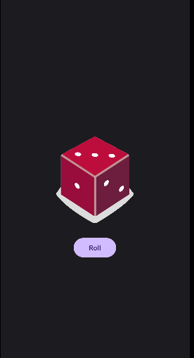
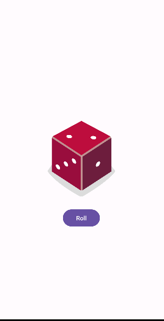

<h1 align="center">Dice Roll🎲</a> 
<h3 align="center"> This is my "Dice Roller" app fo Android in which user roll a dice and view the result</h3>
<h3 align="center"> The interface is very simple, you will need to do is click the button "Roll"</h3>
<h3 align="center">After pressing the button, a dice with a value that turned out randomly will appear on the screen</a>  
<h1 align="center"></a>
<h4 align="center"> This app "Dice Roller" with a minimum API level of 19 ✔️</h1>
<h1 align="center"></a>
<h4 align="center"> Screenshots of the Application below ⬇️ </h4>
<h4 align="center">  </h4>
